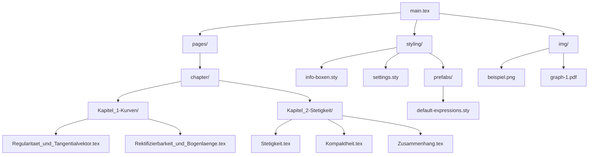

# 📘 Analysis II – Vorlesungsskript in LaTeX

Dies ist ein vollständiges, modular aufgebautes LaTeX-Skript zur **Analysis 2 Vorlesung**.  
Es dokumentiert die Vorlesungsinhalte strukturiert und übersichtlich, mit dem Ziel, später ein passendes **Anki-Karteikarten-Deck** automatisch daraus abzuleiten.

---

## 🔧 Projektstruktur

### Konventionen

- **Kapitelordner:** `Kapitel_1-Kurven`, `Kapitel_2-Stetigkeit` etc.
- **Themendateien:** Keine Leerzeichen oder Umlaute im Dateinamen  
  (`Konvexe_Mengen.tex` statt `Konvexe Mengen.tex`)
- **Struktur:** Jede `.tex` Datei beginnt mit einer `\subsection{...}`

---

## ✨ Features

- 📚 Strukturierung nach Kapitel & Themen
- 🎨 Minimalistisches, druckfreundliches Farbschema (Blau/Grau)
- 📦 Eigene `tcolorbox`-Stile für:
  - Definitionen (hellblau)
  - Sätze, Lemmata, Theoreme (hellgrau)
  - Beispiele, Beweise etc. → neutraler Textfluss
- 🔄 Wiederverwendbare Box-Komponenten (`styling/info-boxen.sty`)
- ⚙️ Kompatibel mit `pgffor` → automatischer Import von Kapitelseiten
- 🧠 Ziel: Grundlage für automatisierte **Anki-Kartengenerierung**

---

## 🚧 In Entwicklung

- [ ] Vollständige Transkription aller Vorlesungsinhalte
- [ ] Automatische Anki-Exportlogik
- [ ] Glossar & Index
- [ ] Mathematische Visualisierungen

---

## 🤝 Mitwirken

Pull Requests mit Korrekturen, Verbesserungen oder Erweiterungen sind jederzeit willkommen.  
Bitte beachte den vorhandenen Stil und die Strukturvorgaben.

